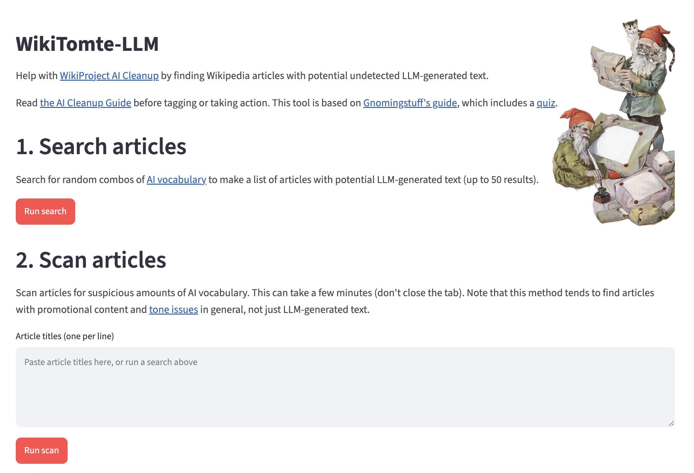
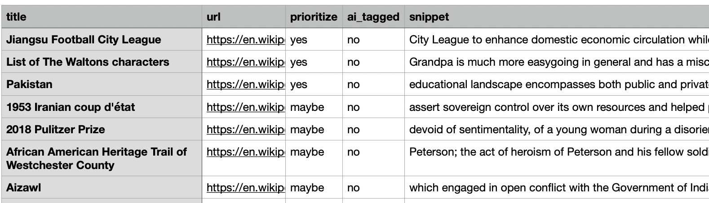
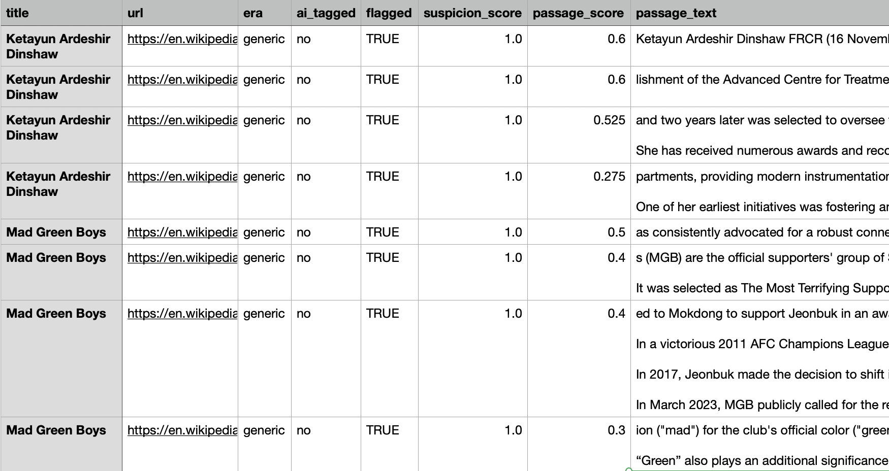

# WikiTomte-LLM

This tool is an experiment in auto-identifying potential undetected LLM-generated text in Wikipedia articles. It produces prioritized lists of suspicious articles for editors to review. The goal is to help editors who want to identify and remove LLM content, especially the dedicated volunteers of [WikiProject AI Cleanup](https://en.wikipedia.org/wiki/Wikipedia:WikiProject_AI_Cleanup), by speeding up their work and making it more fun.

What you can do with this tool:

1. **Search to create a candidate article list.** Run a command to create a list of articles with potential LLM-generated text by searching all articles for random combinations of AI vocabulary. You get a CSV of search results and a plain-text list of article names. (You can import CSVs into Google Sheets or another spreadsheet application to sort, filter, and make decisions.)
2. **Scan candidate articles to find suspicious passages.** Run another command to scan each article on the list for significant LLM vocabulary overall and particularly suspicious passages. You get a CSV with all of the data for review. Make sure you're familiar with [WikiProject AI Cleanup/Guide](https://en.wikipedia.org/wiki/Wikipedia:WikiProject_AI_Cleanup/Guide) before taking action on articles.

You can skip directly to scanning if you want to provide your own list of articles to scan, such as a list you made using [Petscan](https://meta.wikimedia.org/wiki/PetScan/en).

The process is based on [User:Gnomingstuff's guide to finding AI-generated text](https://en.wikipedia.org/wiki/User:Gnomingstuff/Guide_to_finding_AI-generated_text). It uses the vocabulary lists in [Wikipedia:Signs of AI writing](https://en.wikipedia.org/wiki/Wikipedia:Signs_of_AI_writing), supplemented with additional vocabulary lists.

This method tends to find articles with promotional content in general, including some articles with LLM-generated text and other articles that were written by people with [conflicts of interest](https://en.wikipedia.org/wiki/Wikipedia:Conflict_of_interest).

This tool was made by [User:Dreamyshade](https://en.wikipedia.org/wiki/User:Dreamyshade), with the help of [Wikipedia-AI-Skills](https://github.com/fuzheado/Wikipedia-AI-Skills) by [User:Fuzheado](https://en.wikipedia.org/wiki/User:Fuzheado), using [Cursor](https://en.wikipedia.org/wiki/Cursor_%28company%29). Check out [WikiProject AI Tools](https://en.wikipedia.org/wiki/Wikipedia:WikiProject_AI_Tools) if you'd like to learn about using LLMs for making tools. It is called WikiTomte-LLM because a [tomte](https://en.wikipedia.org/wiki/Nisse_(folklore)) in Nordic folklore is a small person-like creature who lives in your house, a bit like a [gnome](https://en.wikipedia.org/wiki/Wikipedia:WikiGnome), who is mostly helpful but not always.

Web app:



Search - CSV output:



Scan - CSV output:



## Web app (GitHub Codespaces)

[](https://codespaces.new/brittag/WikiTomte-LLM)

The fastest way to try WikiTomte-LLM in a browser:

1. Click **Open in GitHub Codespaces** above.
2. Add a [Codespaces secret](https://docs.github.com/en/codespaces/managing-your-codespaces/managing-secrets-for-your-codespaces) named `WIKITOMTE_USER_AGENT` with your contact info, for example:
   ```
   WikiTomte-LLM/1.0 (User:YourUsername, you@example.com) WikiTomte-LLM/1.0
   ```
3. Rebuild or recreate the codespace if you add the secret after creation.
4. The Streamlit app opens on port **8501** — search for candidates, review results, then scan.

The web app runs random search only (v1). Era-builder, freeform queries, and other CLI options remain available below.

## Set up command-line interface

Download and install the code:

`git clone https://github.com/brittag/WikiTomte-LLM.git`

`cd WikiTomte-LLM`

`pip install -r requirements.txt`

Set up a unique User-Agent, per [Wikimedia's User-Agent policy](https://foundation.wikimedia.org/wiki/Policy:Wikimedia_Foundation_User-Agent_Policy). Copy `config.example.json` to `config.json` and replace the placeholder with your email address or Wikipedia username. In Codespaces, use the `WIKITOMTE_USER_AGENT` secret instead.

```bash
cp config.example.json config.json
# Edit config.json to add your contact info
```


## Start

**Step 1: Search.** Find candidate articles by searching Wikipedia for random combinations of AI vocabulary words, and review the list of search results with excerpts. Returns a maximum of 100 results by default.

```bash
python3 assets/search_triage.py \
  -o triage.csv --write-articles candidates.txt
```

Review `triage.csv`. Edit `candidates.txt` to remove obvious false positives and any other articles you don't need to scan in depth, such as articles already flagged for AI cleanup. See [docs/search-triage.md](docs/search-triage.md) for column meanings.

**Step 2: Scan.** Scan remaining candidates for suspicious passages across AI vocabulary lists from multiple eras (GPT-4, GPT-4o, GPT-5, generic AI vocabulary list).

```bash
python3 assets/ai_detector.py candidates.txt -o report.csv
```

See [docs/csv-output.md](docs/csv-output.md) for scan report column meanings.

## Scan a list of articles (skip search)

If you already have a list of articles that you want to scan:

```bash
python3 assets/ai_detector.py articles.txt -o report.csv
```

See [examples/articles.txt](examples/articles.txt) for the input format (one title per line; `#` for comments).

## Advanced options


### Custom search queries

By default, the search picks a random era, then either three words or a phrase plus two words from the AI vocabulary. If you want to search using your own CirrusSearch strings, use `--query` with `--era`:

```bash
python3 assets/search_triage.py \
  --query '"crucial role" emphasize underscore' --era gpt4o \
  -o triage.csv --write-articles candidates.txt
```

More query modes and examples: [docs/search-triage.md](docs/search-triage.md).

### Scan options

Restrict to one era band (`gpt4`, `gpt4o`, `gpt5`, or `generic`):

```bash
python3 assets/ai_detector.py articles.txt --era gpt4o -o report.csv
```

JSON output and other flags (`--min-score`, `--delay`): [docs/csv-output.md](docs/csv-output.md).